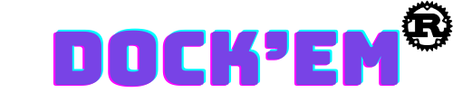

This is the Github Action used to install the [dockem-rs](https://github.com/LynchSKM/dockem-rs) `cli`.

# Usage

Below is an example of a Github Action that pulls in the `cli`,

```yaml
name: "Run Action"

on:
  push:
    branches:
      - main
      - develop

jobs:
  run:
    runs-on: ubuntu-latest
    steps:
      - name: Checkout
        uses: actions/checkout@v3

      - name: Setup Dockem
        uses: LynchSKM/setup-dockem-rs@v1

      - name: Run Dockem
        run: dockem-rs --version
```

You are able to track a specific version or the latest within that major version number. For instance, you can use `v1.0.1` like so,
```yaml
      - name: Setup Dockem
        uses: LynchSKM/setup-dockem-rs@v1.0.1

      - name: Run Dockem
        run: dockem-rs --version
```

Or use the latest of version `1` like so,
```yaml
      - name: Setup Dockem
        uses: LynchSKM/setup-dockem-rs@v1

      - name: Run Dockem
        run: dockem-rs --version
```